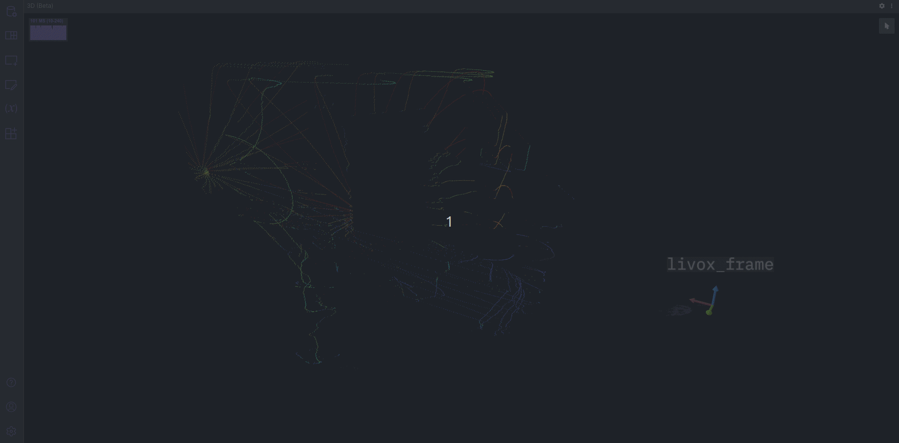

# BloX Livox ROS2 Driver

The BloX Livox ROS2 Driver interfaces with a [Livox LiDAR](https://www.stereolabs.com/zed-mini/) using the [Livox ROS2 Driver](https://github.com/Livox-SDK/livox_ros2_driver).

## Data

The BloX Livox ROS2 Driver publishes a point cloud as [sensor_msgs/PointCloud2 Message](https://docs.ros2.org/foxy/api/sensor_msgs/msg/PointCloud2.html)

## Visualization

